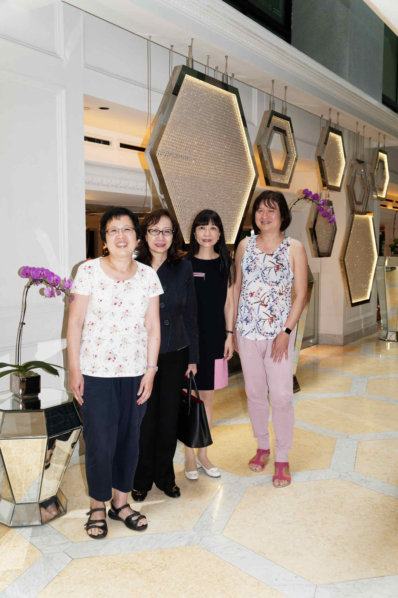
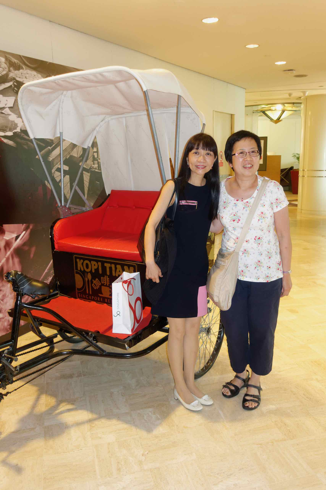
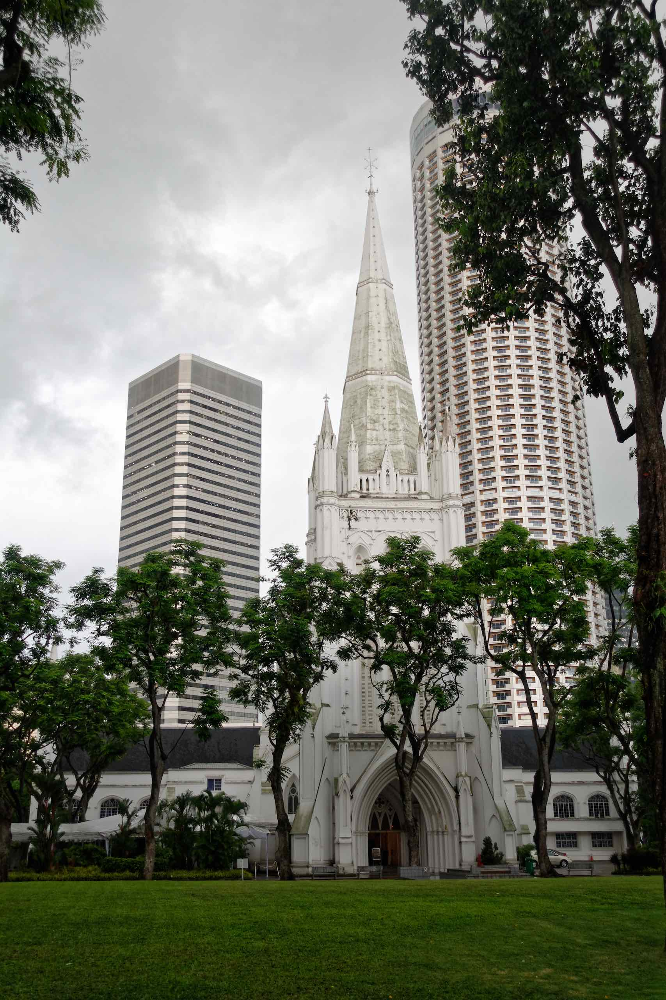
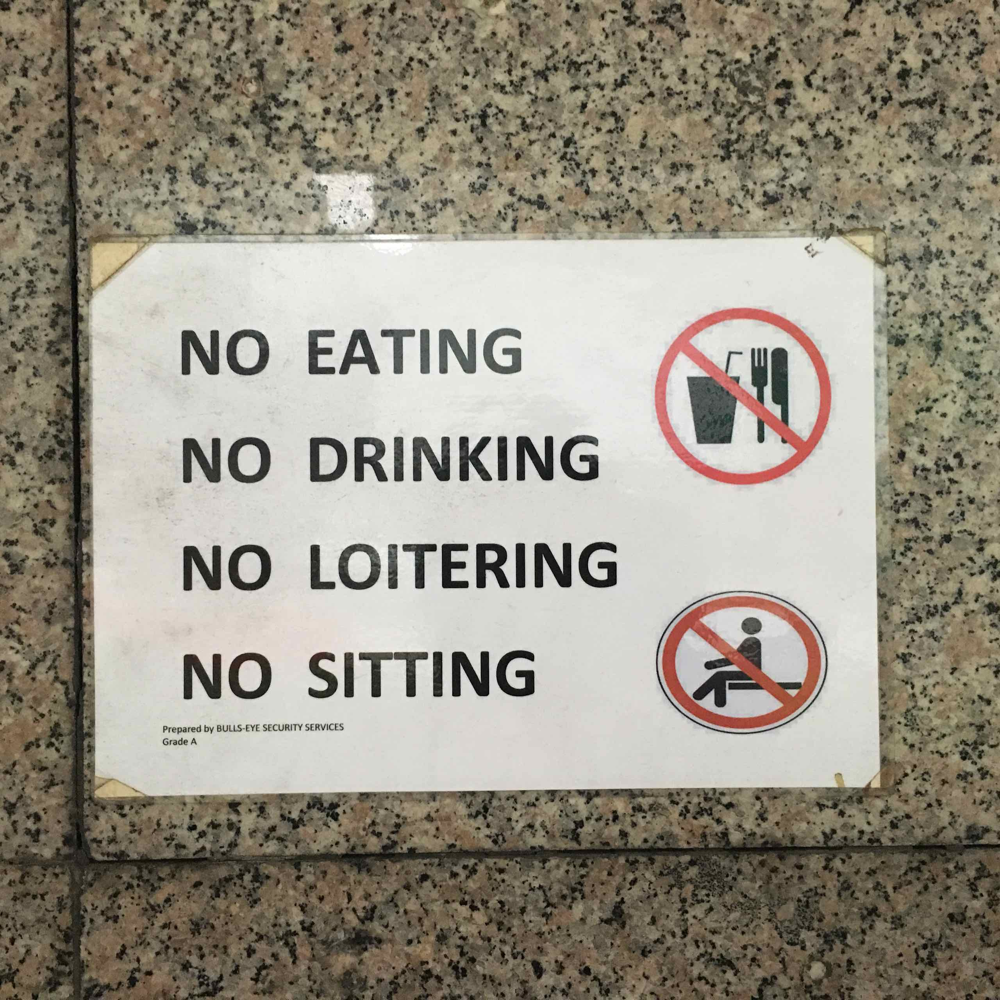

We caught up with two classmates/friends from school today – Ai Bee and Siew Ching – I haven’t met them in over 30 days so I was excited and nervous at the same time. I was wondering whether I’ll even recognise them but after a few moments of hesitation it was like the years in between simply disappeared and we spent a large part of the day reminiscing about our school days. We updated each other on what has happened in the intervening years and by coincidence all three of us have ended up in the finance industry.

I discovered I have selective memory as there were a few incidents that I did not remember that my friends remembered so vividly. I think my brain has a filter that only retains happy memories as all I remembered were the good teachers and the good times (such as when we all went on a bus trip to Kuala Lumpur – none of my friends remembered that until I prompted them).

Siew Ching took us to Kopi Tiam at [Swissôtel The Stamford](https://www.swissotel.com/hotels/singapore-stamford/dining/kopi-tiam/) within the Raffles City complex.

After lunch we walked towards [St. Andrew’s Cathedral](https://cathedral.org.sg/) which is the largest cathedral in Singapore.

However, it started raining quite heavily, so we took shelter at The Adelphi, which turned out to be a shopping mall devoted to high end audio. Much as I would have liked to browse through the shops, I suspect the prices will be expensive and in any case I did not want to be tempted. I did browse through a music store, and was staggered to find they were selling used LPs for S$88!

Outside the Adelphi, I saw a sign that pretty much says it all!

