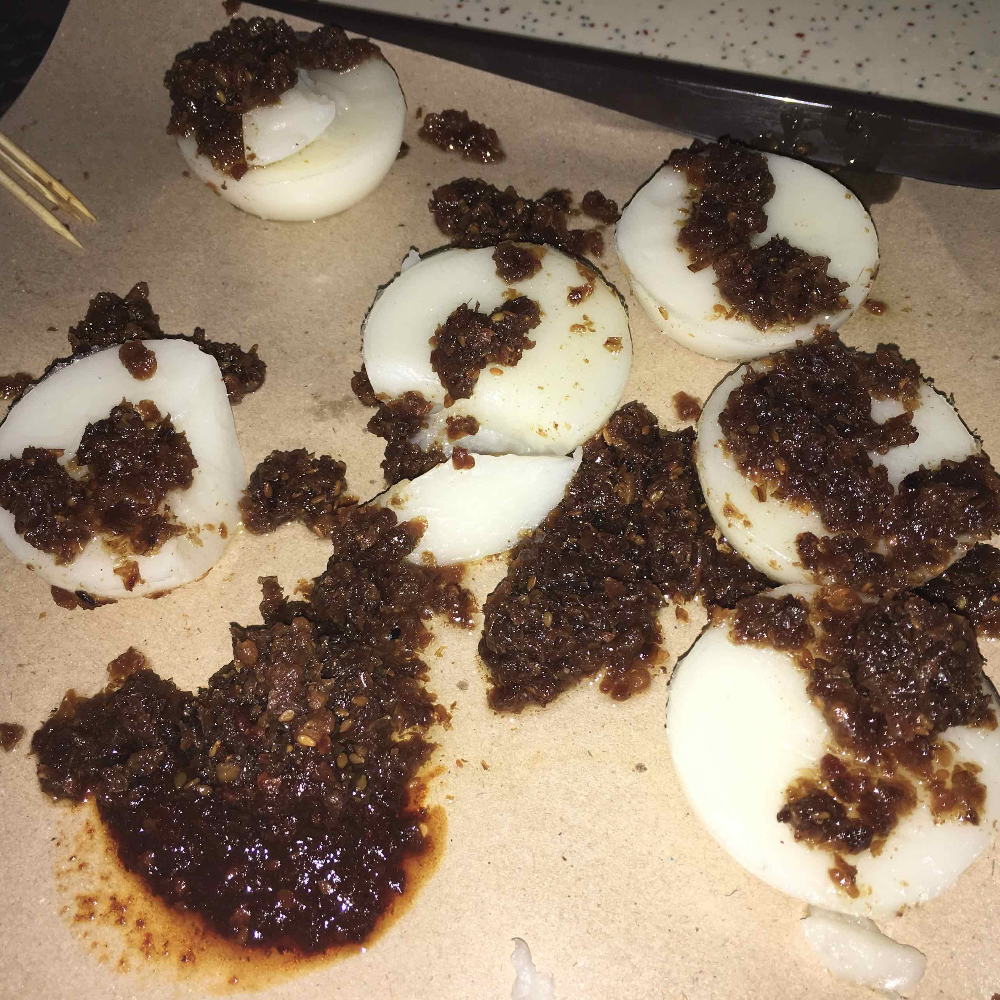
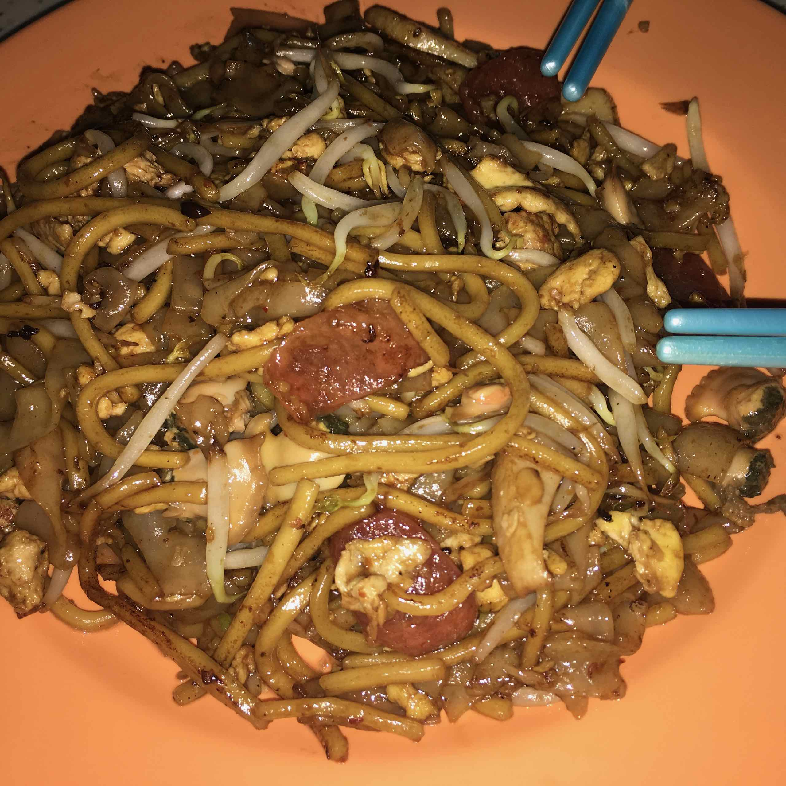
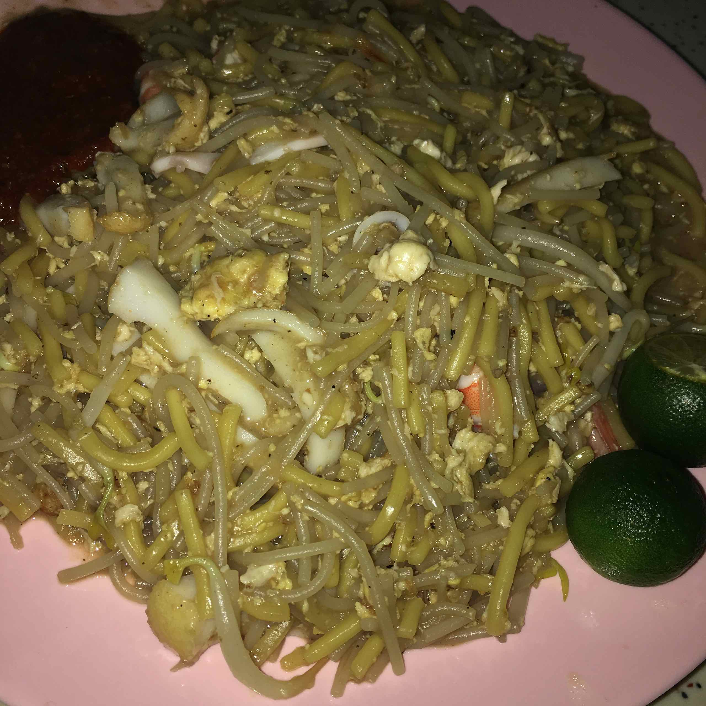

The idea of a national garden in Singapore started in 1822 when Sir Stamford Raffles, the founder of modern Singapore and a keen naturalist, developed the first ‘Botanical and Experimental Garden’ at Fort Canning. It was only in 1859 that the Gardens at its present site was founded and laid out in the English Landscape Movement’s style by an Agri-Horticultural society. The Gardens was soon handed over to the British colonial government (in 1874) and a series of Kew-trained botanists saw the Gardens blossom into an important botanical institute over the following decades. Today, the Gardens is managed by the National Parks Board, a statutory board of the Singapore government.

The [Botanic Gardens][1] has been inscribed as a UNESCO World Heritage Site at the 39th session of the World Heritage Committee (WHC) on 4 July 2015. The Gardens is the first and only tropical botanic garden on the UNESCO’s World Heritage List. It is the first in Asia and the third botanic gardens inscribed in the world following Orto botanico di Padova and the Royal Botanic Gardens, Kew.

We mainly spent our time at the National Orchid Garden but also visited the famous Bandstand and walked through the Rainforest trail.

Afterwards, we went to [Tiong Bahru Market and Food Centre][2] for lunch. Here we indulged in a variety of Singapore dishes including Chwee Kueh from Jian Bo Shui Kueh and a fried prawn noodle stall (Hong Heng) that has been awarded a Michelin star!

[1]: https://www.sbg.org.sg
[2]: http://tiongbahru.market
