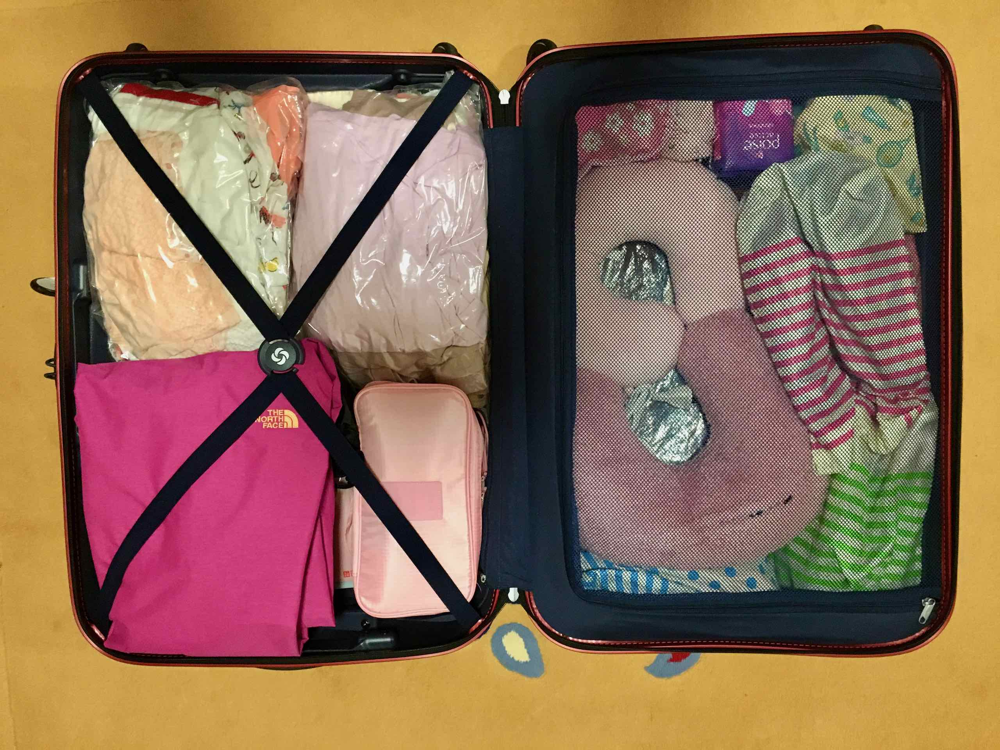
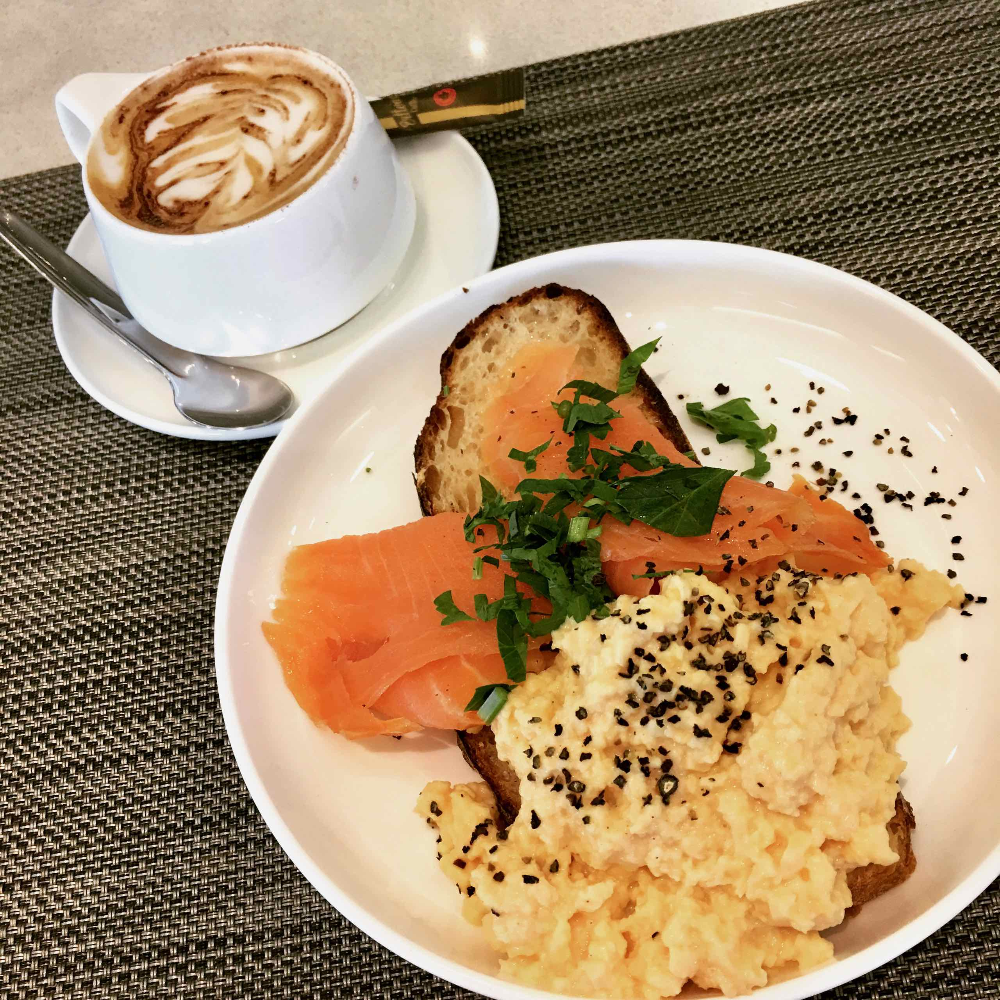
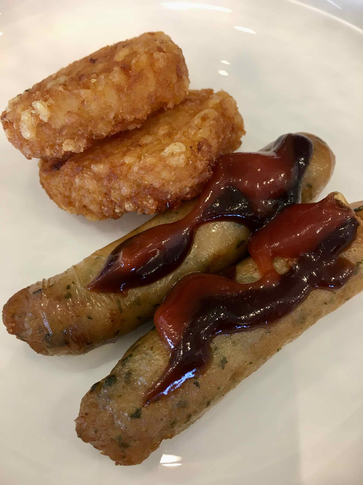
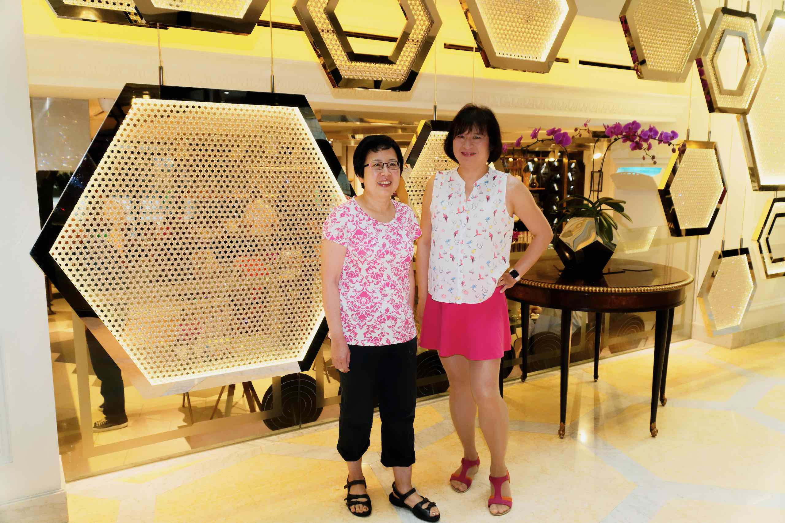
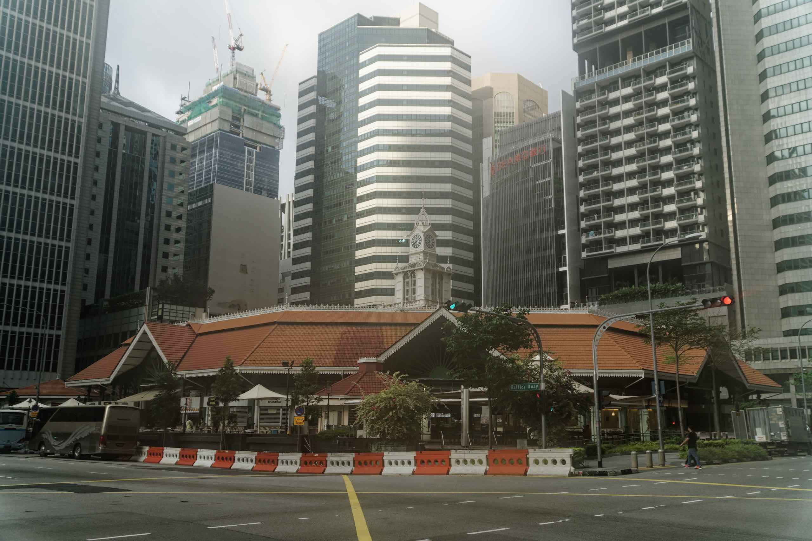
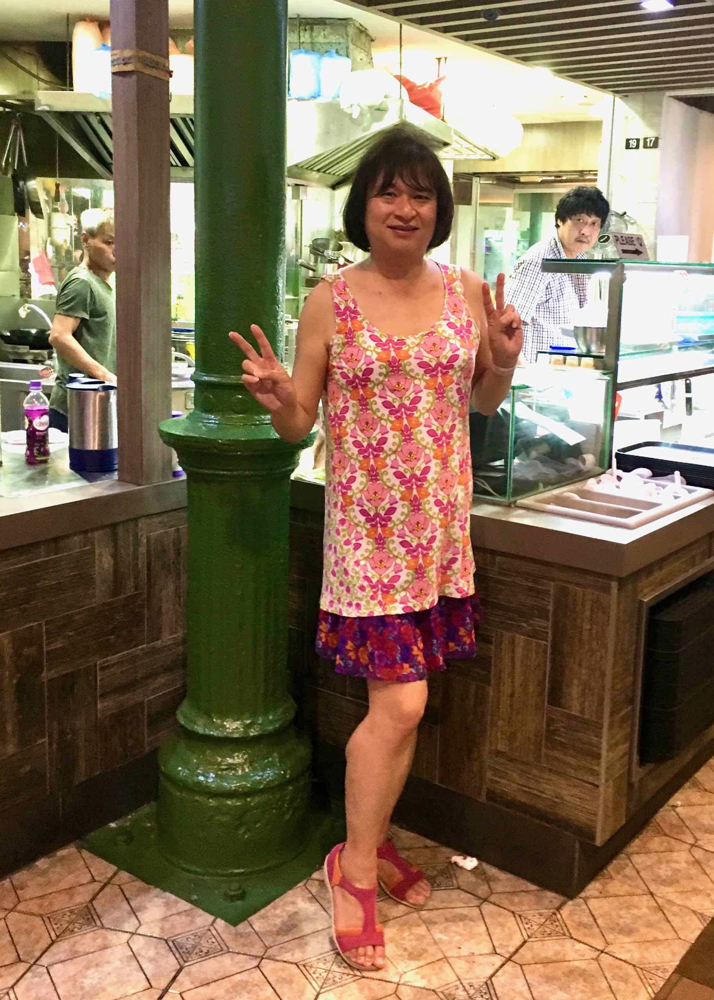
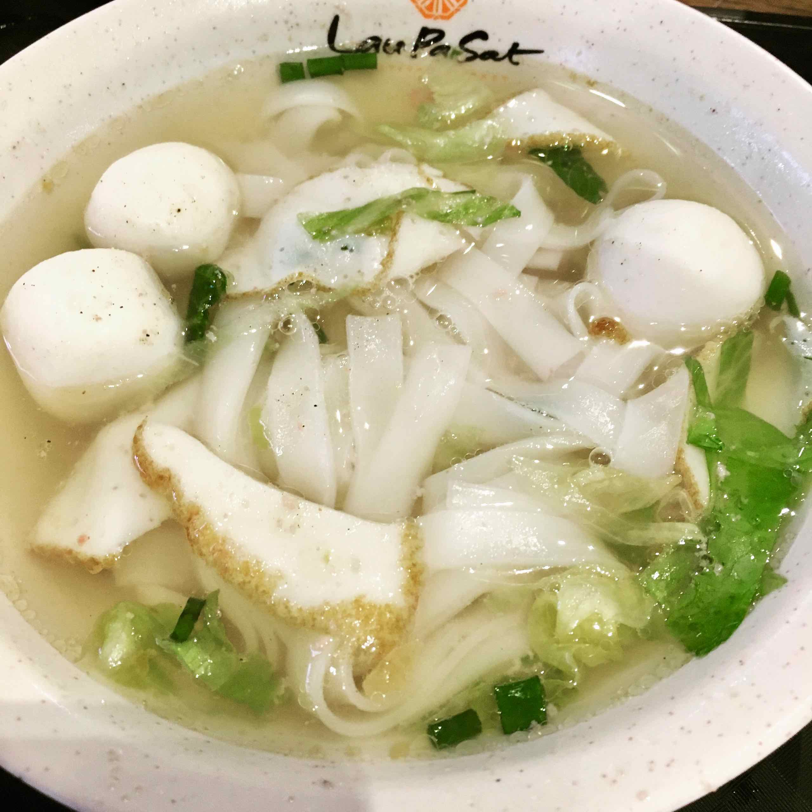

Well this is it! Our trip to Singapore after 5 years! Bag all packed and ready to go!

We had breakfast at the Qantas Lounge before boarding QF81 at 11:15 to Singapore:

We arrived at Singapore around 5pm on Tuesday, checked into the beautiful [So Sofitel][1] located in the heart of the Financial District

We then headed out to the historic [Lau Pa Sat][2] food hawker centre (formerly a market) for a quick and early dinner.

This is a typical store at the Hawker Centre:

I wasn't very hungry, so I ended up eating a small bowl of Teochew Fishball and Fishcake noodle soup:

[1]: https://www.sofitel-so-singapore.com
[2]: https://en.wikipedia.org/wiki/Lau_Pa_Sat
