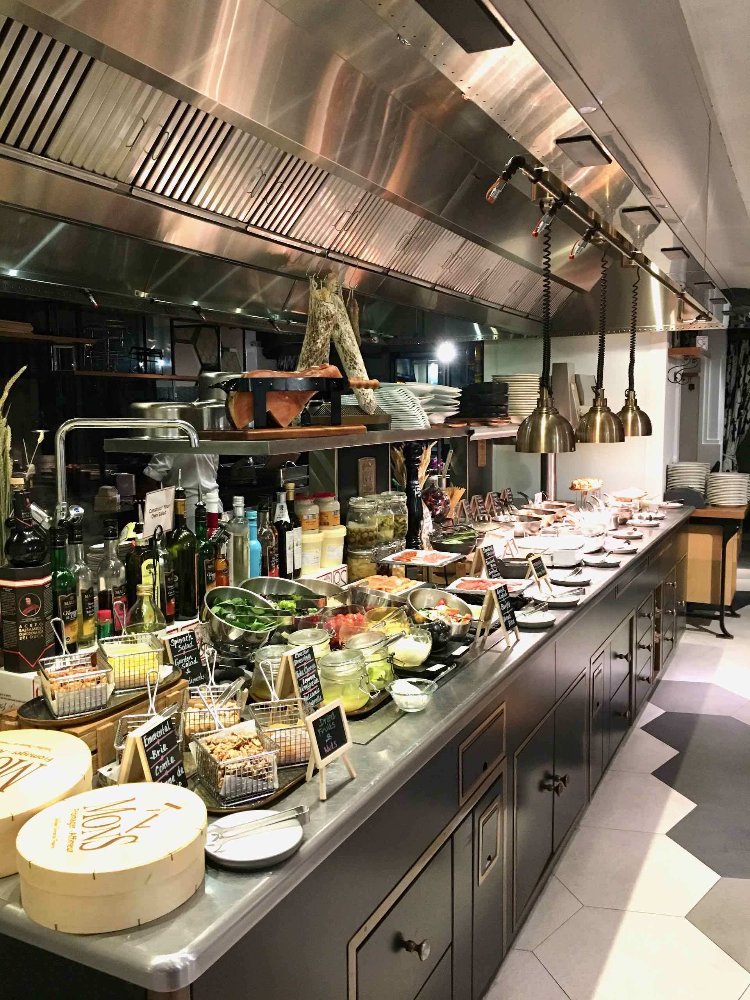
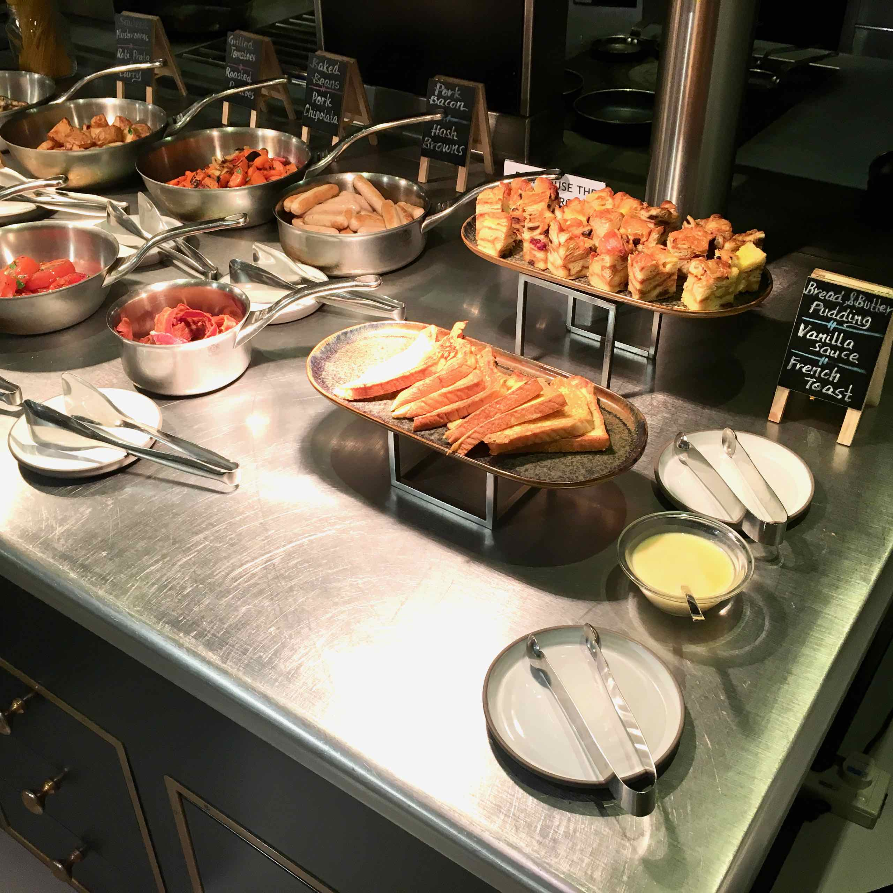

First Day in Singapore, or Malaysia rather! Our plan is to head to the Singapore Flyer, before boarding a bus to LEGOLand in Malaysia.

By the way, this is what breakfast looks like at the hotel (a fantastic buffet selection):

We will spend the rest of the day at [LEGOLAND Malaysia][1], and we have already booked two seats on a tour bus to get there. A private bus picked us up at the hotel around 8am and taken to Singapore Flyer where the tour bus departs.

Because it is too early in the morning, we did not experience the giant observation wheel of Singapore Flyer itself. The [official website][2] tells more about this place.

Having about 30 mins to kill, we decided to explore the base of the observation wheel. There is a rainforest garden here occupying the entire central atrium of the main Terminal Building. The “rainforest” contains tropical trees and shrubs, cascading water displays, streams, and rocky outcrops beneath the Flyer wheel.

I also found some interesting orchids here, as well as birds of paradise. It was also a good place to take photographs of myself, as the day was quite early.

Singapore Flyer is located close to Marina Bay. There are some similarities to the London Eye, but it’s actually bigger. At one stage it was the world’s biggest ferris wheel, until the High Roller opened in Las Vegas.

The wheel commenced operation in 2008 (just before the Great Financial Crisis). There has been a few operational faults when people have been trapped for several hours. In 2013, the company operating it ran into financial difficulties and went into receivership. Another company (Straco) now own and operate the facility.

Singapore Flyer is a prominent landmark of Singapore. It is featured in a few films, most notably Crazy Rich Asians.

[1]: https://www.legoland.com.my
[2]: http://www.singaporeflyer.com
